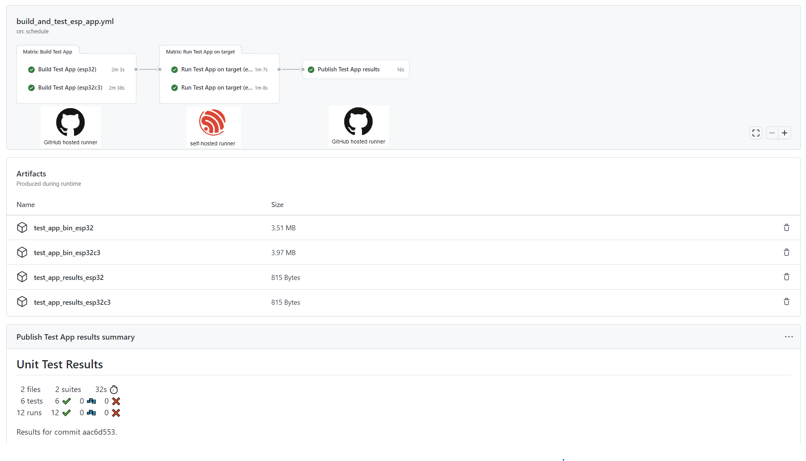

# ESP-IDF Project Template with CI and Hardware Testing

This is a template project to be used as a reference for ESP-IDF projects with GitHub CI.

The purpose of this project is to provide a good **starting point for customers who are developing an application based on Espressif chips and want to run unit or integration tests on real hardware.**

*You can fork and update this project according to your specific needs.*

> Note: As default, the hardware testing job is `disabled`. To enable it, please see the **How to Setup** documents.

## Documentation

In this example project, we will set up the necessary hardware for testing as well as the GitHub Action CI workflow.

Your application code will be automatically tested on real hardware (Espressif chips) in a scheduled workflow (nightly build), if changes are pushed to your repository, or you can run the tests manually.

## How to Setup

- [GitHub Action Workflow](docs/ghub_action_workflow.md)
- [GitHub Runner Setup](docs/ghub_runner_setup.md)

## License

The content of this repository is released into the public domain, or [CC0 licensed](LICENSE), at your option.
